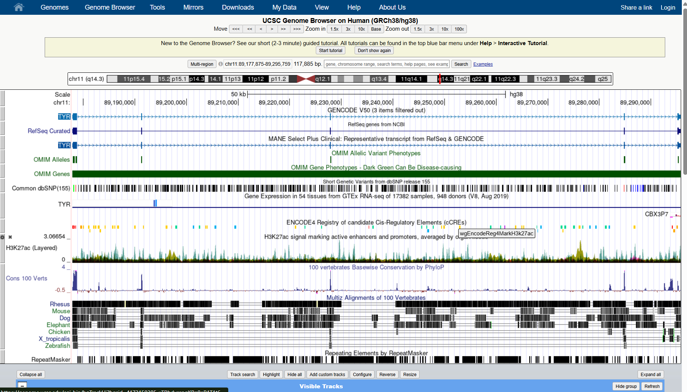
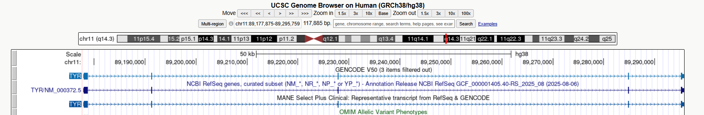
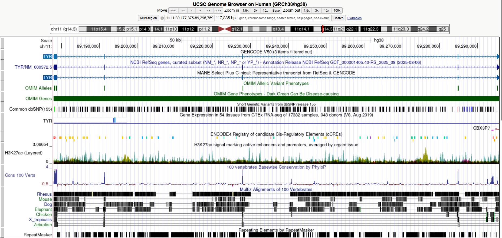
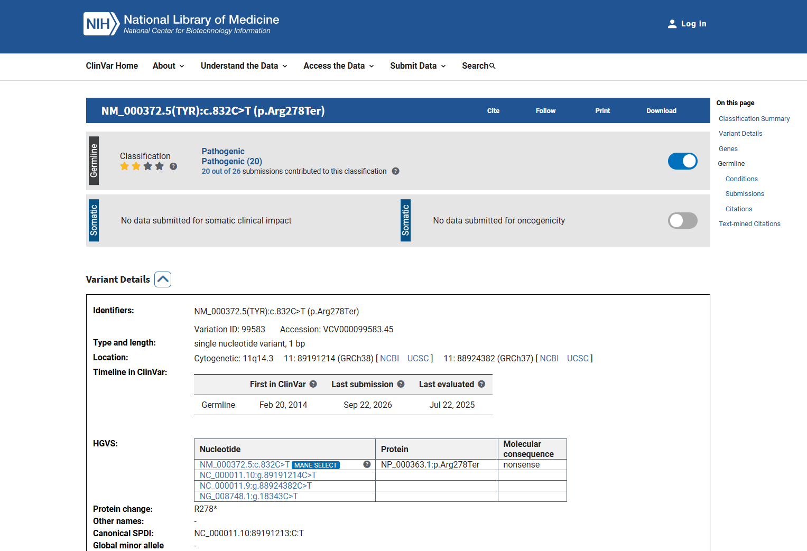

# Activity Screenshots

This folder contains screenshots from the UCSC Genome Browser and NCBI ClinVar activity.

## Screenshot 1: Gene Location

**Figure 1.** Genomic location of the human TYR gene in the UCSC Genome Browser (GRCh38/hg38).

This screenshot presents the genomic location of the human TYR gene in the UCSC Genome Browser using the GRCh38/hg38 assembly. The gene is located on chromosome 11 at 11q14.3 and spans the region chr11:89,177,875–89,295,759.
## Screenshot 2: Gene Structure

**Figure 2.** Exon–intron structure of the human TYR gene in the UCSC Genome Browser.

The exon–intron structure of the human TYR gene is illustrated in this image. The middle NCBI RefSeq track labeled TYR/NM_000372.5 was used as the selected transcript for identifying and counting the five exons.

## Screenshot 3: Conservation Track

**Figure 3.** Conservation track of the human TYR gene in the UCSC Genome Browser.

Figure 3 shows the human TYR gene together with the 100 Vertebrates Conservation by PhyloP track, specifically displayed under “Cons 100 Verts.” The varying conservation peaks indicate that some regions of the TYR genomic region are more strongly conserved across species than others.

## Screenshot 4: ClinVar Variant Record

**Figure 4.** ClinVar record of the pathogenic TYR c.832C>T (p.Arg278Ter) variant.

The image shows the ClinVar record for the *TYR* variant NM_000372.5:c.832C>T (p.Arg278Ter). The record classifies the variant as Pathogenic and identifies it with Variation ID 99583 and VCV000099583.45. Its GRCh38 genomic position is shown at chromosome 11:89,191,214, and the molecular consequence is reported as a nonsense variant.

